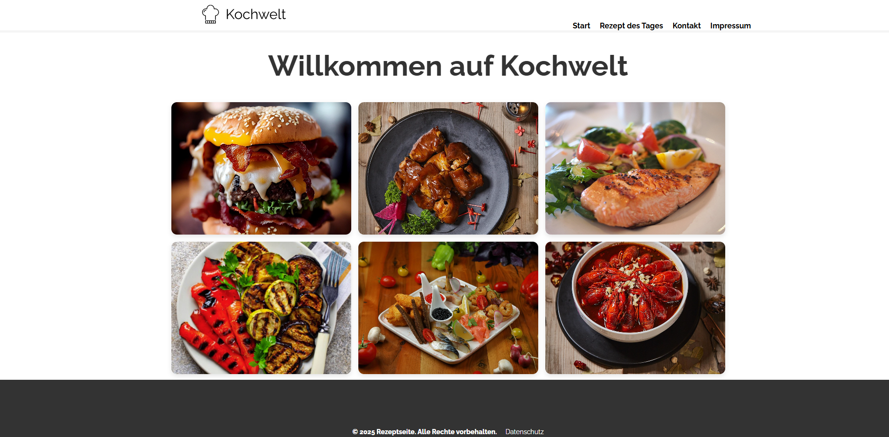

🍳 Kochwelt – Moderne Rezept-Webseite

Eine responsive Rezeptplattform mit dynamischer Portionsberechnung, Kontaktformular und klassischer Mehrseiten-Struktur.

🚀 Live Demo

👉 https://ismael993-create.github.io/Kochwelt/index.html

📸 Preview

🧩 Projektbeschreibung

Kochwelt ist eine moderne, responsive Rezept-Webseite mit mehreren Unterseiten.

Die Plattform bietet:

Eine visuelle Startseite mit Rezept-Galerie

Ein „Rezept des Tages“ mit dynamischer Portionsberechnung

Ein Kontaktformular

Impressum & Datenschutz

Mobile Navigation mit Burger-Menü

Das Projekt verbindet strukturiertes HTML, responsives CSS und funktionales JavaScript.

✨ Features
🏠 Startseite

Visuelle Rezept-Galerie

Responsive Layout

Klare Navigation

🍽️ Rezept des Tages

Zutatenliste

Dynamische Portionsberechnung mit JavaScript

Automatische Mengenanpassung

Benutzerfreundliche Interaktion

📩 Kontaktformular

Eingabefelder für Nutzeranfragen

Formularstruktur mit Validierung

Abschicken-Funktion

📄 Rechtliches

Impressum

Datenschutzseite

📱 Responsive Design

Mobile Burger-Menü

Flexible Grid-Layouts

Anpassung an verschiedene Bildschirmgrößen

🛠️ Verwendete Technologien

HTML5 (semantische Struktur)

CSS3 (Flexbox, Grid, Media Queries)

Vanilla JavaScript

Responsive Navigation (Checkbox-Burger-System)

Google Fonts (Raleway)

⚙️ JavaScript-Funktionalität
Portionsrechner

Benutzer gibt gewünschte Portionsanzahl ein

Zutatenmengen werden automatisch neu berechnet

Dynamische DOM-Manipulation

Saubere Trennung von Struktur und Logik

📱 Responsive Verhalten

Desktop: Horizontale Navigation

Tablet: Angepasstes Layout

Mobile: Burger-Menü mit Toggle-System

Flexible Bildgrößen

🎯 Lernziele des Projekts

Aufbau einer klassischen Multi-Page-Website

Strukturierung von Navigationssystemen

Umsetzung eines dynamischen Portionsrechners

Responsive Webdesign

Formularstruktur und Benutzerinteraktion

Saubere Projektorganisation
